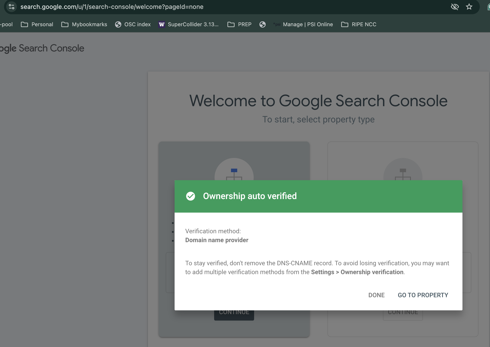

# SEO Setup Guide for ThinkingCow.dev

## Current SEO Implementation ✅

### 1. Sitemap (Automated)
- **Plugin**: `jekyll-sitemap` is installed
- **URL**: https://www.thinkingcow.dev/sitemap.xml
- **Status**: Auto-generated on every build
- **Action**: No action needed - Jekyll automatically creates and updates

### 2. Robots.txt ✅
- **Location**: `/robots.txt`
- **Status**: Configured and pointing to sitemap
- **Content**: Allows all search engines, directs to sitemap

### 3. Structured Data (Schema.org) ✅
- **Person Schema**: Added for Tapasvi Bansal name searches
- **Website/Blog Schema**: Added for site-wide SEO
- **Location**: `_layouts/default.html` (lines 73-106)
- **Searchable Terms**:
  - Tapasvi
  - Security Researcher
  - Software Engineer
  - Cloud Security
  - Product Security

### 4. Meta Tags ✅
- **SEO Plugin**: `jekyll-seo-tag` installed
- **Keywords**: Updated in `_config.yml` with personal name
- **Author Info**: Updated with full name "Tapasvi Bansal"

## Google Search Console Setup (Required)

### Step 1: Verify Ownership

1. Go to [Google Search Console](https://search.google.com/search-console)
2. Click "Add Property"
3. Enter your URL: `https://www.thinkingcow.dev`
4. Choose verification method:

**Option A: HTML File Upload** (Recommended)
- Download the verification HTML file
- Upload to your site root: `/google[VERIFICATION_CODE].html`
- Click "Verify"

**Option B: HTML Meta Tag**
- Copy the meta tag provided
- Add to `_layouts/default.html` in the `<head>` section:
  ```html
  <meta name="google-site-verification" content="YOUR_VERIFICATION_CODE" />
  ```
- Rebuild and deploy your site
- Click "Verify"

**Option C: DNS Verification** (I control the DNS)
- Add TXT record to your domain's DNS settings
- Wait for DNS propagation
- Click "Verify"



### Step 2: Submit Sitemap

After verification:
1. In Google Search Console, go to "Sitemaps" (left sidebar)
2. Enter: `sitemap.xml`
3. Click "Submit"

Google will now crawl your site regularly.

### Step 3: Request Indexing for Key Pages

Immediately index important pages:
1. Go to "URL Inspection" tool
2. Enter these URLs one by one:
   - `https://www.thinkingcow.dev/`
   - `https://www.thinkingcow.dev/herd/tapasvi/`
   - `https://www.thinkingcow.dev/about/`
   - `https://www.thinkingcow.dev/posts/`
3. Click "Request Indexing"

This speeds up the process for Google to discover your name and content.

## Google Analytics Integration ✅

### Current Status
- **Tracking ID**: G-GV4X074578
- **Privacy Compliance**: Cookie consent implemented
- **IP Anonymization**: Enabled
- **Location**: `_layouts/default.html` (lines 117-224)

### Note on Search Visibility
Google Analytics **does NOT** improve search rankings. It only provides traffic data.

For search visibility, you need **Google Search Console** (see above).

## How Search Engines Find Your Name

### 1. Structured Data (Person Schema)
The Person schema in your HTML tells Google:
- Name: "Tapasvi Bansal"
- Alternate Name: "Thinking Cow"
- Job Title: "Security Researcher & Software Engineer"
- Knowledge Areas: Security, Cloud, Privacy, etc.
- Social Profiles: GitHub, LinkedIn, Twitter

This appears in your site's HTML on every page.

### 2. Meta Keywords
Updated in `_config.yml`:
```yaml
keywords: "Tapasvi Bansal, tapasvi, security research, privacy tools..."
```

### 3. Profile Page
Your profile at `/herd/tapasvi/` has:
- Title: "Tapasvi Bansal"
- Description with your name
- Keywords targeting name searches
- Canonical URL

## Expected Timeline

| Action | Timeframe |
|--------|-----------|
| Submit sitemap | Immediate |
| Google discovers site | 1-3 days |
| Pages start appearing in search | 3-7 days |
| Full indexing complete | 1-2 weeks |
| Name searches start working | 2-4 weeks |

## Verifying Search Visibility

### Check if pages are indexed:
```
site:thinkingcow.dev
```

### Check for your name:
```
"Tapasvi Bansal" site:thinkingcow.dev
```

### Check specific page:
```
site:thinkingcow.dev/herd/tapasvi/
```

## Additional SEO Improvements

### 1. Create Content with Your Name
- Blog posts with author byline
- About sections mentioning your name
- Project descriptions with attribution

### 2. Build Backlinks
- Link to your site from:
  - GitHub profile README
  - LinkedIn profile
  - Other social media
  - Guest posts or contributions

### 3. Regular Content Updates
- Add new blog posts in `/moo/`
- Update existing content
- Search engines favor active sites

### 4. Social Signals
- Share your posts on social media
- Engage with content
- Build your online presence

## Monitoring SEO Performance

### Google Search Console Metrics to Watch:
1. **Impressions**: How often your site appears in search
2. **Clicks**: How many people click through
3. **Average Position**: Where you rank for searches
4. **Queries**: What people search to find you

### Track these searches:
- "Tapasvi Bansal"
- "tapasvi security researcher"
- "tapasvi cloud security"
- "thinking cow security"

## Common Issues

### Site not appearing in search?
1. Verify Google Search Console ownership
2. Check robots.txt isn't blocking
3. Submit sitemap
4. Request indexing manually
5. Wait 1-2 weeks for initial indexing

### Name searches not working?
1. Ensure Person schema is present in HTML
2. Check keywords include your name
3. Build more content with your name
4. Get backlinks from other sites
5. Allow 2-4 weeks for Google to associate your name

### Low ranking?
1. Create more high-quality content
2. Build backlinks
3. Improve page speed
4. Add more structured data
5. Regular updates

## Technical SEO Checklist ✅

- [x] Sitemap.xml generated and accessible
- [x] Robots.txt configured
- [x] SSL/HTTPS enabled
- [x] Mobile responsive design
- [x] Fast page load times
- [x] Structured data (Person + Website schemas)
- [x] Meta descriptions on all pages
- [x] Canonical URLs set
- [x] Open Graph tags for social sharing
- [x] Twitter Card tags
- [x] Security headers configured
- [ ] Google Search Console verified (Action Required)
- [ ] Sitemap submitted to Google (Action Required)

## Next Steps

1. **Verify Google Search Console** (highest priority)
2. **Submit sitemap.xml**
3. **Request indexing for key pages**
4. **Wait 2-4 weeks and monitor**
5. **Create more content regularly**
6. **Build backlinks from other sites**

## Resources

- [Google Search Console](https://search.google.com/search-console)
- [Google Rich Results Test](https://search.google.com/test/rich-results)
- [Schema.org Person Documentation](https://schema.org/Person)
- [Jekyll SEO Tag Plugin](https://github.com/jekyll/jekyll-seo-tag)

---

**Last Updated**: 2025-11-30
**Maintained by**: Tapasvi Bansal
